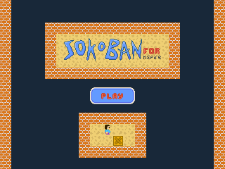
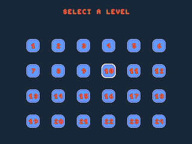
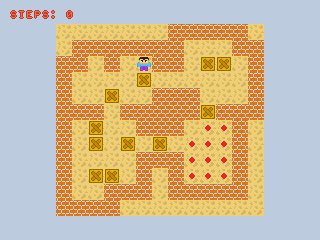
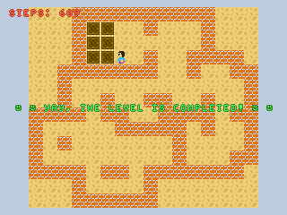

# Sokoban for TI-Nspire

A [Sokoban](https://en.wikipedia.org/wiki/Sokoban)-inspired game for the [Nspire](https://en.wikipedia.org/wiki/TI-Nspire_series) series of graphing calculators. It uses [nSDL](https://github.com/hoffa/nSDL) as an abstraction for rendering.

The game currently features 12 levels, with 24 planned in the future.

## Screenshots






## Controls

- **Arrows/2468**: moving
- **0**: rewind
- **Enter**: select
- **Esc**: go back

## Building

Follow [these steps](https://hackspire.org/index.php?title=C_and_assembly_development_introduction) to install the Ndless SDK.

Then, run:
```
git clone https://github.com/Apmds/Sokoban-nspire.git
cd Sokoban-nspire
make
```

The result of the build is in the ```bin``` directory.

## Running

To run this in a PC, an emulator (such as [firebird](https://github.com/nspire-emus/firebird)) needs to be installed and configured with the appropriate files for it to boot. Then, the same steps as with an actual calculator must be followed. 

In a calculator, [Ndless](https://ndless.me/) must be installed. After that, the ```.tns``` file only needs to be run.

## Credits

- [Hackspire wiki](https://hackspire.org//index.php?title=Main_Page)

- [Sokoban levels](https://www.mathsisfun.com/games/sokoban.html)

- [Convert image to C array](https://github.com/hoffa/nSDL/wiki/NTI-specification)